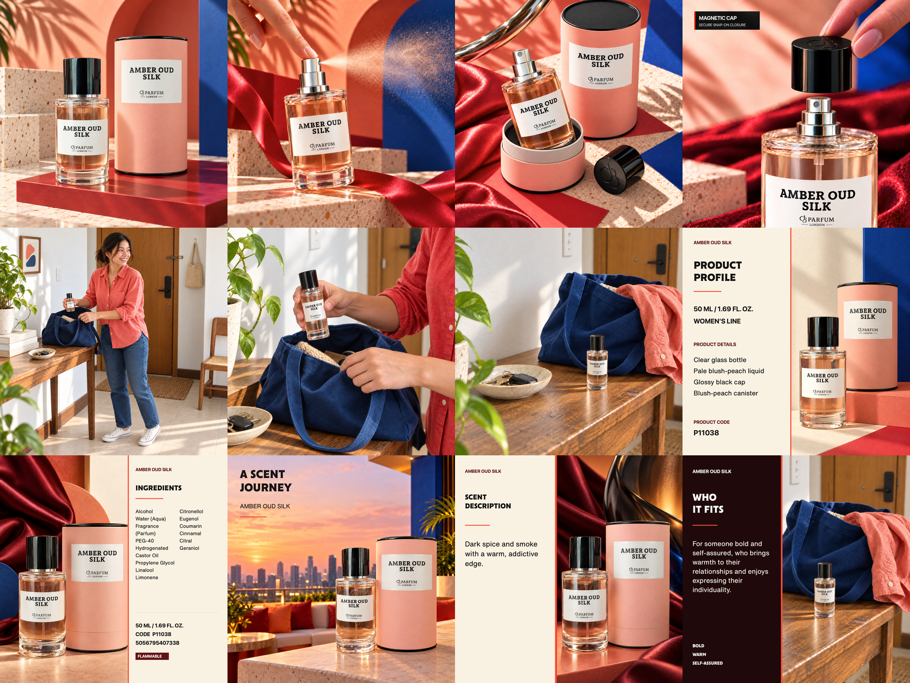

# Amber Oud Silk — current final QA

Latest owner layout update, 24 September 2026: image10 uses the unified box-free closing template. Exact A SCENT JOURNEY heading, subtitle and coral rule share fixed geometry across all14 scents. Only the14 closing heroes changed; all154 other gallery files remain byte-identical. Accepted photography retained. Independent visual review: PASS.

PASS · 24 September 2026 · 12 of 12 final frames reviewed.

Latest owner revision replaces frames 05–07 and the frame 12 photo with warm, vibrant, light and realistic apartment scenes. The other eight Amber frames and all 156 images from the other thirteen scents remain byte-identical. Frame 12’s approved personality text panel is pixel-identical.

| Frame | Status | Current review |
| --- | --- | --- |
| 01 | PASS | Accurate capped cylindrical bottle and matching canister; correct liquid and label color; bright tactile packshot; zero faces. |
| 02 | PASS | Single visible nozzle faces continuous fine mist; natural finger press; correct tall cylinder, thick base, substantial three-stage atomizer; zero faces. |
| 03 | PASS | Authentic separate lower packaging base with raised sleeve/rim and foam, upper canister closed flat black top; uncapped three-stage pump and all-black cap; zero faces. |
| 04 | PASS | Detached all-black cap physically fits compact three-stage atomizer; clear MAGNETIC CAP caption; natural hand; zero faces. |
| 05 | PASS | Owner rejected the synthetic karaoke scene. Rebuilt as a candid full-person home departure moment: natural smile, coral cotton shirt, cobalt canvas bag, ordinary apartment, believable daylight and bottle grip/scale. Exactly one face; both shoes visible. |
| 06 | PASS | Replaced karaoke controls with a face-free hands detail packing the capped bottle into a canvas bag in the same real apartment setting. Corrected bottle geometry, natural grip, readable label and brighter coral/cobalt accents. |
| 07 | PASS | Replaced the staged karaoke still life with a small capped bottle on a worn wooden entry console beside a canvas bag and key dish. Realistic object scale, natural daylight, tactile cotton and canvas; zero faces. |
| 08 | PASS | Clear facts in 58–65px type, black/oxblood on cream; copy left/product right; volume, product code and visible pack details verified. Display heading uses registered CenzoFlare-Bold. |
| 09 | PASS | Exact package ingredient spellings plus volume, product code/barcode and package flammability pictogram interpretation; primary type 44–48px; product left/cream copy right. Display heading uses registered CenzoFlare-Bold. The printed base label shows only the flammable pictogram; no heat/open-flame sentence is printed. The added sentence was removed; FLAMMABLE remains an interpretation of the package pictogram. |
| 10 | `10-closing-hero.png` | Pass: Unified box-free closing hero: identical two-line A SCENT JOURNEY heading, scent-name subtitle, upper-left alignment, type sizes, spacing and coral rule. Dark text chosen for photo contrast. Accepted scent-specific product-and-canister photograph retained; zero faces. |
| 11 | PASS | Approved scent sentence reproduced exactly in deterministic type, dark text on cream, no added notes/claims; zero faces. Display heading uses registered CenzoFlare-Bold. |
| 12 | PASS | Replaced the rejected karaoke photograph with the matching bright home still life. Approved personality paragraph, three traits, heading and left text panel remain pixel-identical; zero faces. |

## Set and export checks

- Reopened and audited the complete contact sheet: coherent color, product identity, scene and typography.
- Exactly one visible adult face, in frame 05; all other frames contain zero faces.
- All twelve PNGs: 2048 × 2048, explicit sRGB, unique images; checksum locks refreshed and verified.
- Approved scent description and personality copy retained.
- Final imagery independently reviewed with no blocking product, anatomy, lighting or scene issues.

[Detailed lifestyle revision](REALISTIC_LIFESTYLE_REVIEW_2026-09-24.md)
