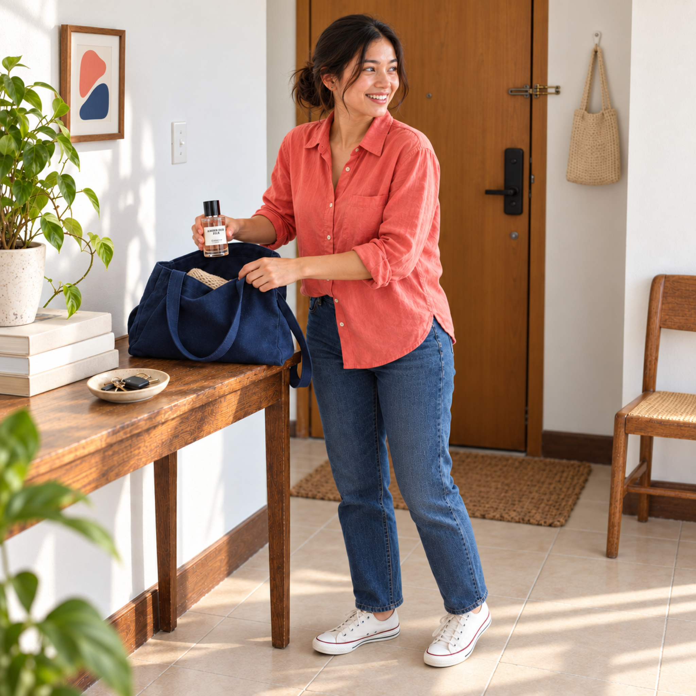
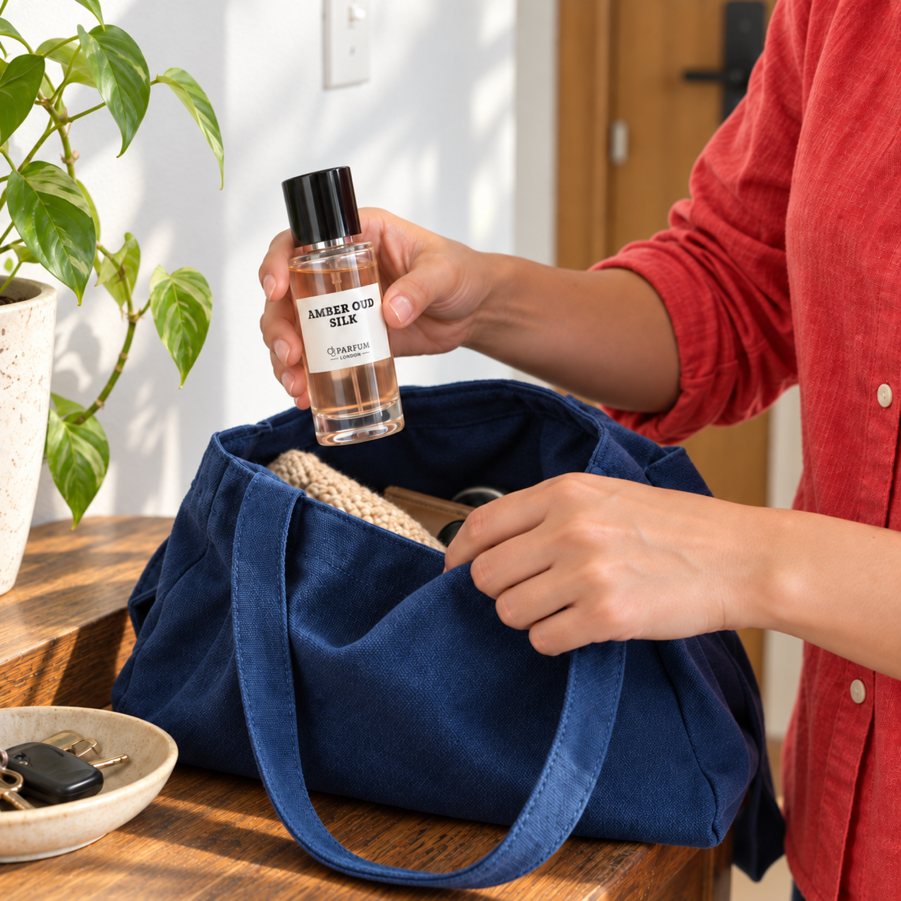
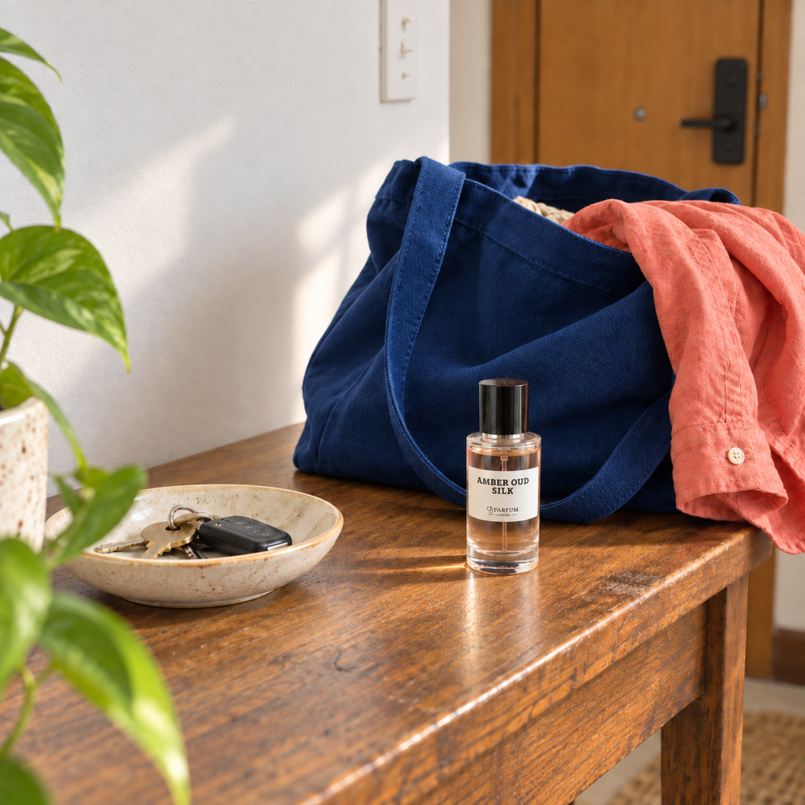
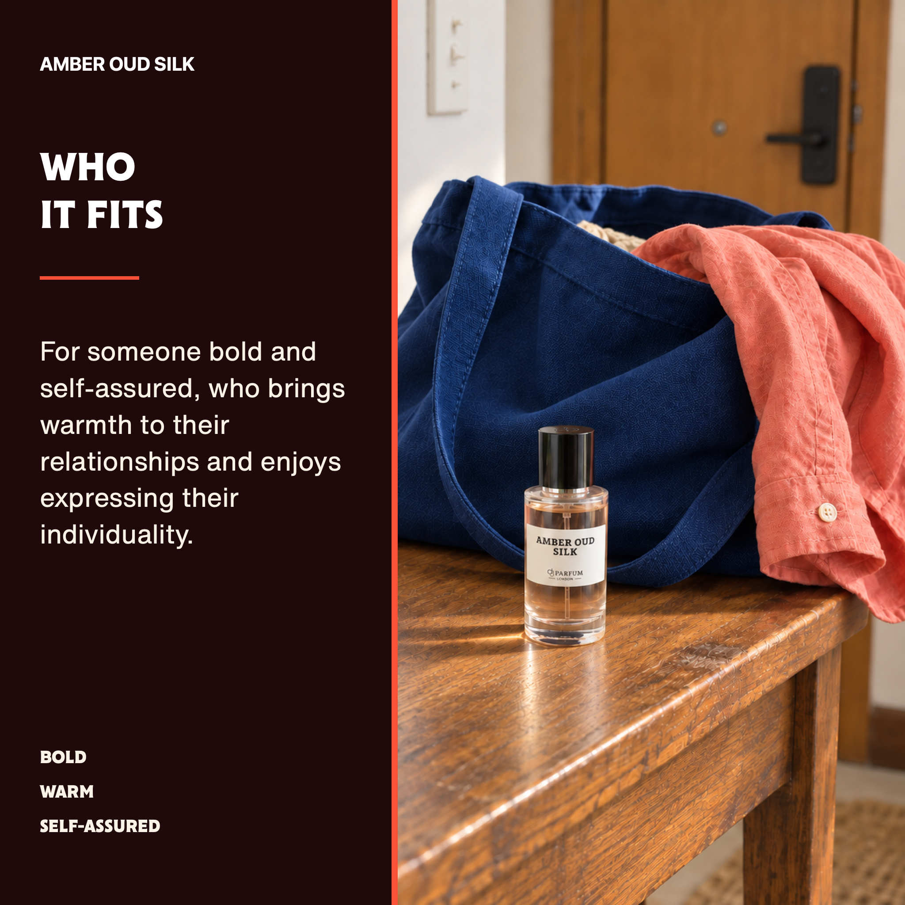

# Amber Oud Silk — realistic lifestyle revision

Owner direction: a believable real scene that still follows the warm, fun, vibrant and light publication guide.

Frames05,06,07 and the photo in12 now use a coordinated apartment departure story. Frames01–04 and08–11 are byte-identical to the prior approved gallery. All13 other scent galleries are unchanged. The frame12 personality text panel is pixel-identical.

## Frame 05

Owner rejected the synthetic karaoke scene. Rebuilt as a candid full-person home departure moment: natural smile, coral cotton shirt, cobalt canvas bag, ordinary apartment, believable daylight and bottle grip/scale. Exactly one face; both shoes visible.

## Frame 06

Replaced karaoke controls with a face-free hands detail packing the capped bottle into a canvas bag in the same real apartment setting. Corrected bottle geometry, natural grip, readable label and brighter coral/cobalt accents.

## Frame 07

Replaced the staged karaoke still life with a small capped bottle on a worn wooden entry console beside a canvas bag and key dish. Realistic object scale, natural daylight, tactile cotton and canvas; zero faces.

## Frame 12

Replaced the rejected karaoke photograph with the matching bright home still life. Approved personality paragraph, three traits, heading and left text panel remain pixel-identical; zero faces.

## Export and provenance

Built-in ImageGen created the photographs using the raw Amber Oud Silk bottle and canonical geometry references. Native1254square outputs were normalized to2048square sRGB PNG. Prompts, baseline hashes and validation are in `working/amber-real-scene-2026-09-24/`. Final12-image contact sheet and SHA-256 locks were refreshed.
